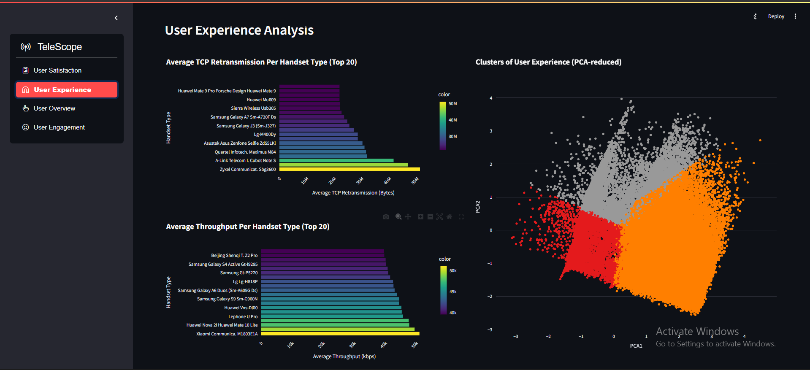

# Telecom User Engagement and Satisfaction Analysis

This project focuses on exploring, analyzing, and interpreting telecommunication data to provide insights into user behavior, engagement, experience, and satisfaction. It includes multiple tasks related to exploratory data analysis (EDA), user segmentation, engagement analysis, experience analytics, and satisfaction prediction using machine learning techniques.




## Project Structure

```
├── .vscode/
│   └── settings.json
├── .github/
│   └── workflows/
│       ├── unittests.yml
├── .gitignore
├── requirements.txt
├── README.md
├── src/
│   ├── __init__.py
│   ├── utils/
│   │   ├── connect_db.py
│   │   ├── data_preprocessor.py
│   │   └── plot.py
├── notebooks/
│   ├── __init__.py
│   ├── README.md
│   ├── 0.0-dataset-overview.ipynb
│   ├── 1.0-user-overview-analysis.ipynb
│   ├── 2.0-user-engagement-analysis.ipynb
│   ├── 3.0-user-experience-analysis.ipynb
│   └── 4.0-user-satisfaction-analysis.ipynb
├── tests/
│   ├── __init__.py
├── scripts/
│   ├── __init__.py
│   └── README.md
├── assets/
│   └── images/
│   └── streamlit/
└── app/
    ├── utils.py
    ├── app.py
    ├── __init__.py


```

## Installation

1. Clone the repository:
   ```bash
   git clone <repo_url>
   cd <project_directory>
   ```

2. Create a virtual environment and install dependencies:
   ```bash
   python -m venv venv
   source venv/bin/activate  # On Windows, use `venv/Scripts/activate`
   pip install -r requirements.txt
   ```

## Running the Streamlit

Navigate to the app folder:
```bash
cd path/to/app
```
Run the Streamlit app:
```bash
streamlit run app.py
```

## Contribution

Feel free to fork the repository, make improvements, and submit pull requests.
